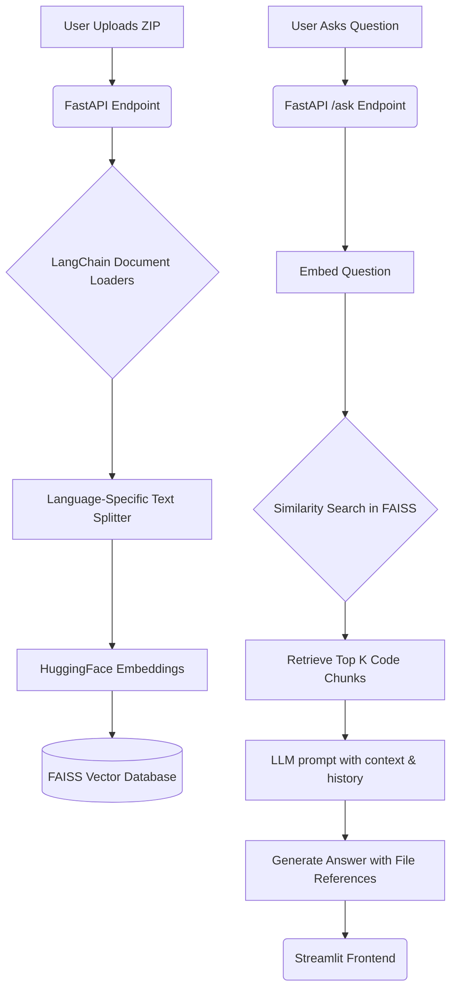

# 🛠️ AI Debugging Assistant

A production-level Retrieval-Augmented Generation (RAG) system designed to help developers debug, document, and refactor entire codebases. You can upload a ZIP of your codebase and ask natural language questions about it.

## 🚀 Features
- **Code-Aware Chunking**: Uses language-specific processing (AST-like logic via Langchain's TextSplitters) to break down code logically without breaking functions.
- **Source Code References**: Returns exact file names and line/snippet references when explaining bugs.
- **Session Memory**: Remembers past interactions in the Streamlit UI to allow for follow-up questions.
- **Local Embedding**: Uses `HuggingFaceEmbeddings` (`sentence-transformers/all-MiniLM-L6-v2`) locally to avoid embedding API costs. completely free.
- **Caching**: Saves the FAISS vector database locally so you don't need to re-embed the code every time you restart the server.
- **Clean UI**: Built with Streamlit for a chatty, intuitive experience.

---

## 🏗️ Architecture



---

## 📂 Folder Structure

```
AI_Debugging_Assistant/
├── backend/
│   ├── main.py              # FastAPI application & endpoints
│   ├── ingestion.py         # Code extraction, chunking, embedding logic
│   ├── retrieval.py         # Search & LLM chain logic
│   ├── requirements.txt     # Backend dependencies
│   ├── uploads/             # Extracted code from ZIP (Gitignored)
│   └── vector_store/        # Local FAISS database (Gitignored)
├── frontend/
│   ├── app.py               # Streamlit interface
│   └── requirements.txt     # Frontend dependencies
└── README.md                # Project documentation
```

---

## ⚙️ Setup & Installation

### 1. Backend Setup
1. Open a terminal and navigate to the `backend/` directory.
2. Create and activate a virtual environment:
   ```bash
   python -m venv venv
   # Windows
   venv\Scripts\activate
   # Mac/Linux
   source venv/bin/activate
   ```
3. Install dependencies:
   ```bash
   pip install -r requirements.txt
   ```
4. Create a `.env` file in the `backend/` directory and add your Google Gemini API Key (or setup for local Ollama):
   ```ini
   GOOGLE_API_KEY=your_gemini_api_key_here
   ```
5. Run the FastAPI server:
   ```bash
   uvicorn main:app --reload --port 8000
   ```

### 2. Frontend Setup
1. Open a new terminal and navigate to the `frontend/` directory.
2. Install dependencies (you can use the same venv or a new one):
   ```bash
   pip install -r requirements.txt
   ```
3. Run the Streamlit app:
   ```bash
   streamlit run app.py
   ```

---

## 🌍 Deployment Steps (Free Tier)

### 1. Vector Database
- Since FAISS stores data on disk as a folder (`vector_store/`), in a cloud environment where storage is ephemeral it will reset on deployment. For production, you can swap FAISS with **Pinecone** (free tier supports up to 100k vectors) or a persistent disk volume on Railway.

### 2. Backend (Render / Railway)
- **Render**: Create a "Web Service", connect your GitHub repo.
  - Root Directory: `backend`
  - Build Command: `pip install -r requirements.txt`
  - Start Command: `uvicorn main:app --host 0.0.0.0 --port $PORT`
  - Set your `GOOGLE_API_KEY` in Render Environment Variables.

### 3. Frontend (Streamlit Cloud / Vercel)
- **Streamlit Community Cloud**:
  - Point it to your repo.
  - Main file path: `frontend/app.py`
  - Ensure your `backend_url` in `app.py` points to your newly deployed Render URL instead of `localhost:8000`.

---
